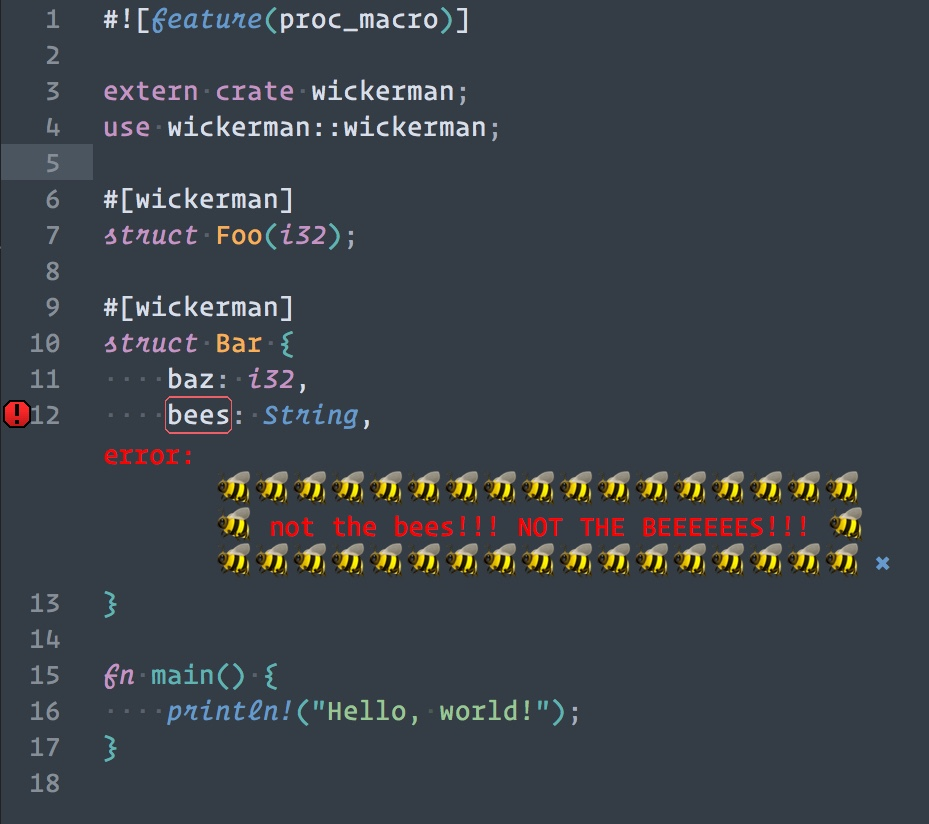

# Wickerman

Display error messages inspired by The Wicker Man in your Rust code



## About

This crate is meant to illustrate how to make a simple procedural macro in Rust. There is an accompanying blog post that explains what procedural macros are and how to make them:

* [Introdution to Procedural Macros](https://tinkering.xyz/posts/introduction-to-proc-macros/)

To see the error message above, add `wickerman` as a dependency in your `Cargo.toml`:
```toml
# Cargo.toml
[dependencies]
wickerman = {git = "https://github.com/zmitchell/wickerman"}
```

then use `wickerman::wickerman` in a crate with procedural macros enabled:
```rust
#![feature(proc_macro)]

extern crate wickerman;
use wickerman::wickerman;
```

and, finally, apply the `#[wickerman]` attribute to a struct containing a field named "bees".

```rust
#[wickerman]
struct Foo {
    bees: i32,
}
```

To see even more absurd error messages, add the `go-nuts` feature to `Cargo.toml`, and apply the attribute to a struct with several fields.

```toml
# Cargo.toml
[dependencies]
wickerman = {git = "https://github.com/zmitchell/wickerman", features = ["go-nuts"]}
```

## License

Licensed under either of

 * Apache License, Version 2.0, ([LICENSE-APACHE](LICENSE-APACHE) or http://www.apache.org/licenses/LICENSE-2.0)
 * MIT license ([LICENSE-MIT](LICENSE-MIT) or http://opensource.org/licenses/MIT)

at your option.

### Contribution

Unless you explicitly state otherwise, any contribution intentionally
submitted for inclusion in the work by you, as defined in the Apache-2.0
license, shall be dual licensed as above, without any additional terms or
conditions.
